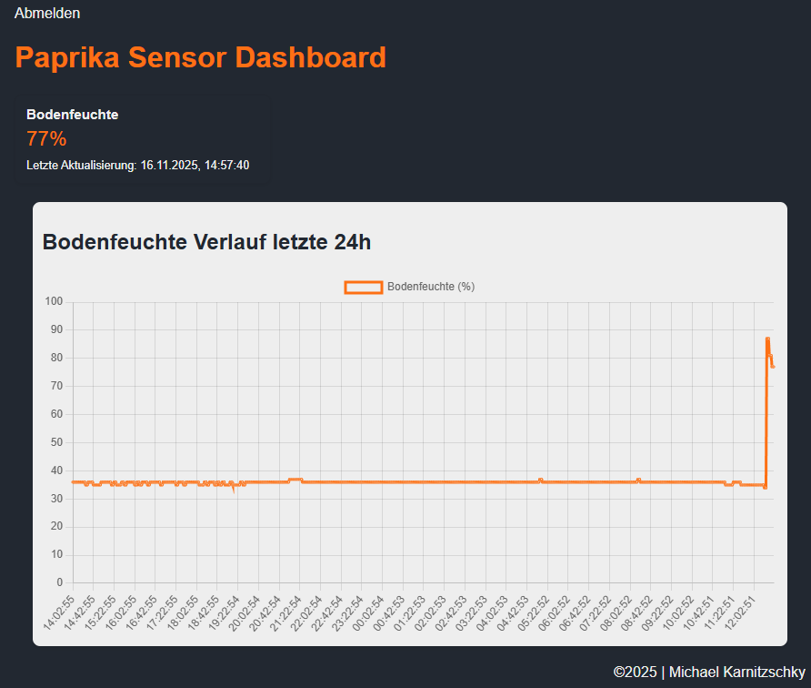

 # Mein Paprika-Monitor – Ein kleines, praktisches Lernprojekt
​
Dieses Projekt ist mein erster Schritt, um die Welt der Softwareentwicklung mit Hardware zu verbinden. Die Idee entstand aus einem einfachen Problem: Ich möchte meine Paprikapflanze überwintern und gieße immer zu viel. Also habe ich eine kleine Web-Anwendung gebaut, die mir die Bodenfeuchtigkeit anzeigt.
​
Dieses Projekt war eine riesige Lernchance für mich. Es hat mir geholfen, grundlegende Konzepte der Webentwicklung, Datenbanken und Kommunikation in einem praktischen Szenario zu verstehen.
​
 ## Was das Projekt kann
​
 *   **Echtzeit-Daten:** Zeigt die aktuelle Bodenfeuchtigkeit an, die von einem Sensor gemessen und per MQTT gesendet wird.
 *   **Login-System:** Ein einfaches Login-System, um zu üben, wie man Benutzer authentifiziert.
 *   **Datenbank:** Die Sensordaten werden in einer Datenbank gespeichert, um sie für Diagramme zu nutzen.
 *   **Diagramm:** Die Sensordaten werden in einem Diagramm ausgegeben.
 *   **API:** Ein kleiner API-Endpunkt, um die Sensordaten im JSON-Format abzurufen.

## Meine App im Einsatz

​
 ## Verwendete Technologien
​
 Ich habe versucht, eine Reihe von Technologien zu verwenden, die in der Webentwicklung üblich sind:
​
 *   **Backend:** Python mit dem Flask Framework (Weil ich mich da schon ein wenig auskenne).
 *   **Datenbank:** Flask-SQLAlchemy zur Anbindung einer Datenbank.
 *   **Authentifizierung:** Flask-Login für das User-Management.
 *   **Echtzeit-Kommunikation:** Paho-MQTT für den Empfang der Sensordaten.
 *   **Frontend:** Simples HTML/CSS und ein bisschen JavaScript (in den Templates), um die Daten dynamisch zu laden und als Diagramm zu präsentieren.
 *   **Hardware:** Ein ESP32 mit einem kapazitiven Bodenfeuchtigkeitssensor.
​
 ## Was ich gelernt habe
​
 Dieses Projekt war eine Herausforderung, aber ich habe unglaublich viel gelernt:
​
 *   **Arduino bzw. ESP Grundlagen:** Wie man Sensoren ausliest und die entstandenen Daten über MQTT versendet.
 *   **MQTT-Protokoll:** Wie Geräte über ein Netzwerk miteinander kommunizieren können. 
 *   **Datenbanken:** Die Grundlagen von Models und wie man Daten mit SQLAlchemy speichert und abfragt.
 *   **Benutzer-Authentifizierung:** Wie man ein einfaches Login mit flask und gehashten Passwörtern umsetzt.
 *   **Konfigurations-Management:** Wie man sensible Daten wie Passwörter mit `.env`-Dateien aus dem Code heraushält.
 *   **Deployment & Infrastruktur:** Wie man eine Anwendung auf einem Cloud-Server (VPS, z.B. ein DigitalOcean Droplet) bereitstellt.
 *   **Linux-Serveradministration:** Die Grundlagen der Konfiguration eines Ubuntu-Servers über die Kommandozeile (SSH).
 *   **Webserver & Reverse Proxy:** Wie man Nginx einrichtet, um die Anwendung sicher und performant über das Internet erreichbar zu machen.
 *   **Websicherheit:** Die Wichtigkeit von HTTPS und wie man die Verbindung mit einem kostenlosen SSL-Zertifikat (z.B. von Let's Encrypt) absichert.
​
 ## Zukünftige Ideen
​
 Das Projekt ist noch lange nicht fertig! Hier sind ein paar Dinge, die ich als Nächstes ausprobieren möchte:
​
 *   Mehr Sensoren integrieren (z.B. für Temperatur und Licht).
 *   Eine automatische Benachrichtigung einrichten, die mir meldet, wenn die Pflanze zu trocken wird.
 *   Das System um eine kleine Pumpe erweitern, die die Pflanze automatisch bewässert.
